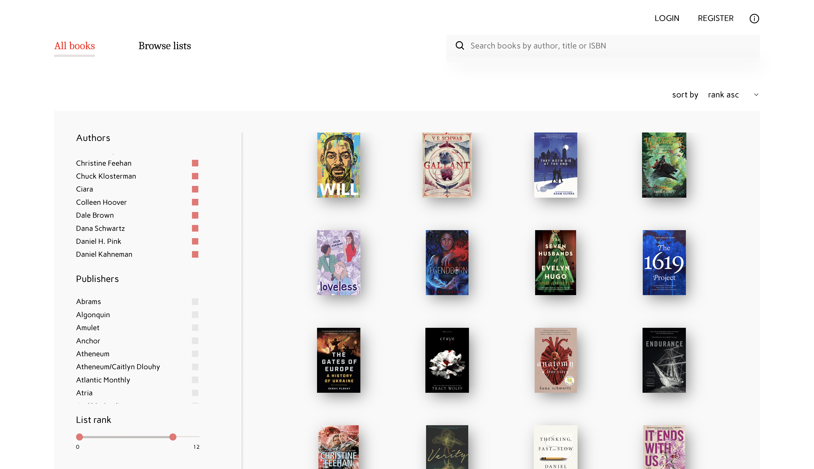
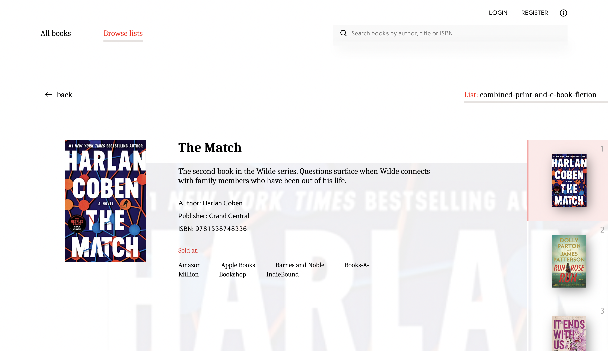

A React app for looking up books and book lists from the 'New York Times' Books API. 

Link to concept design (figma): https://www.figma.com/file/lTHK9k6FxxLiSRDcSYqFlV/BestBooks.store?node-id=0%3A1

Technologies used:

- Axios
- Redux Toolkit
- Redux Thunks
- React-router
- Lodash

All components are build from scratch with the exeption of the Loader indicator:
https://mhnpd.github.io/react-loader-spinner/

