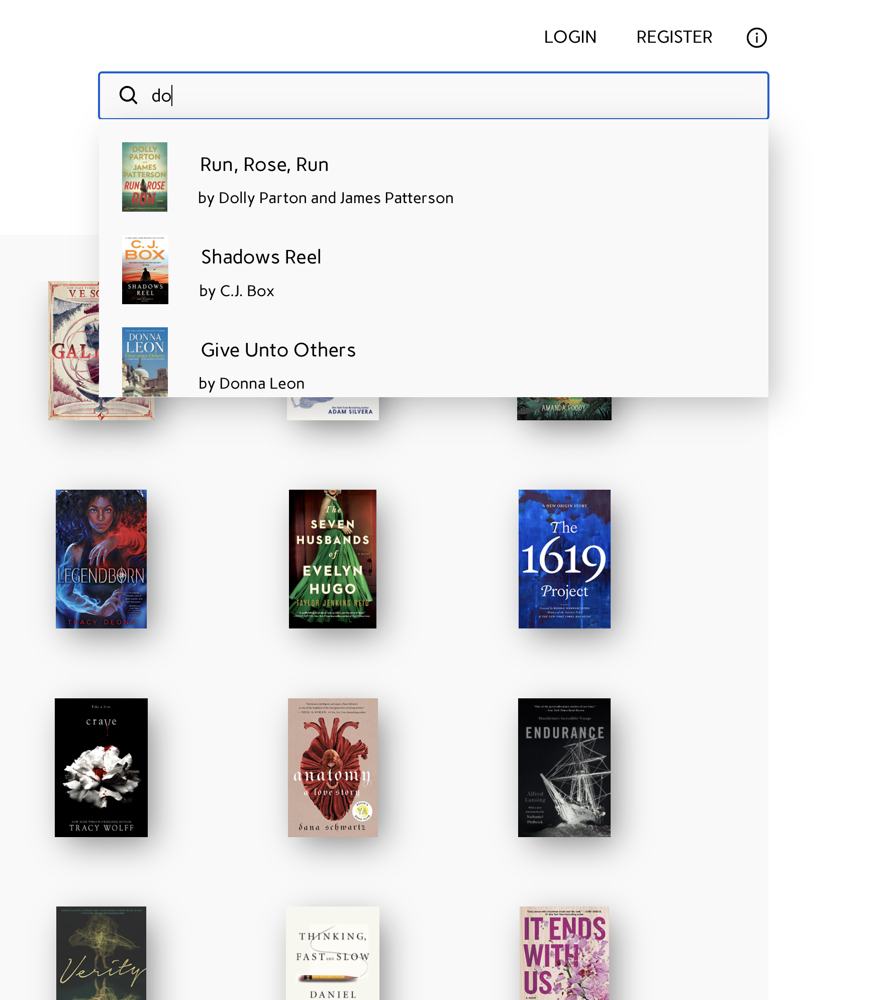
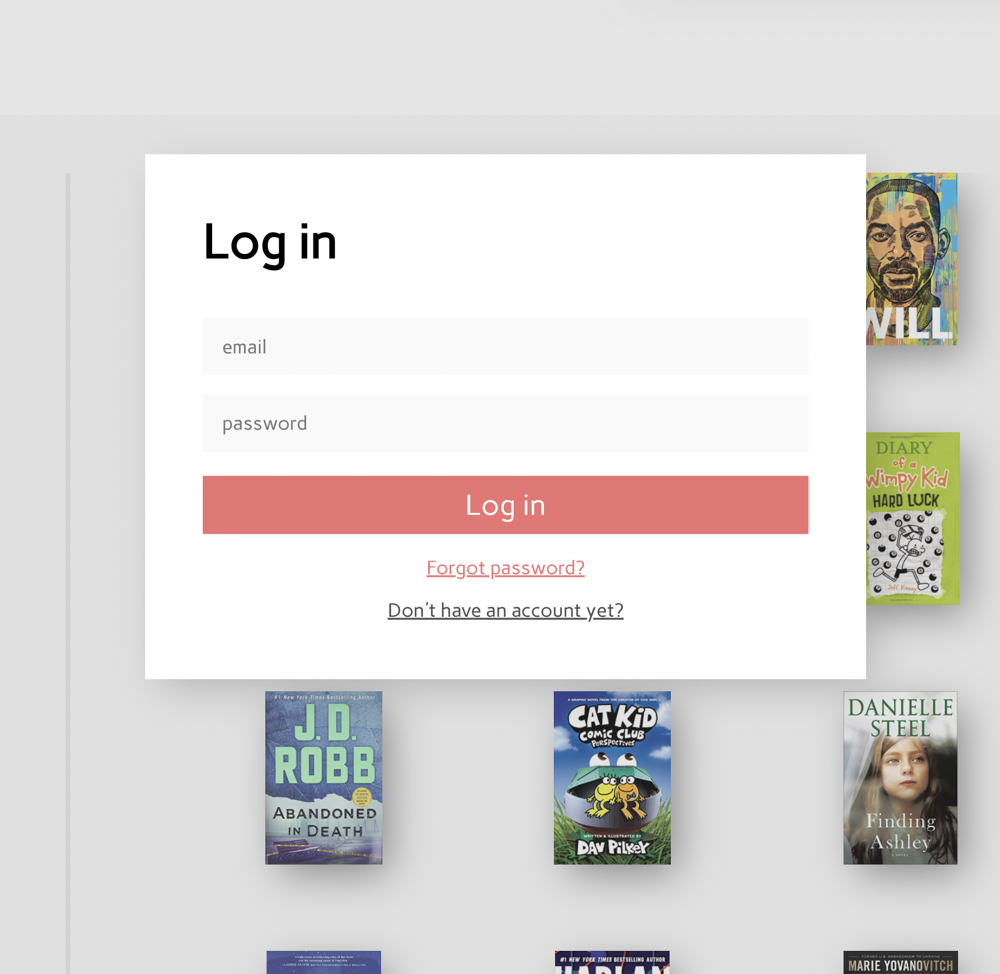
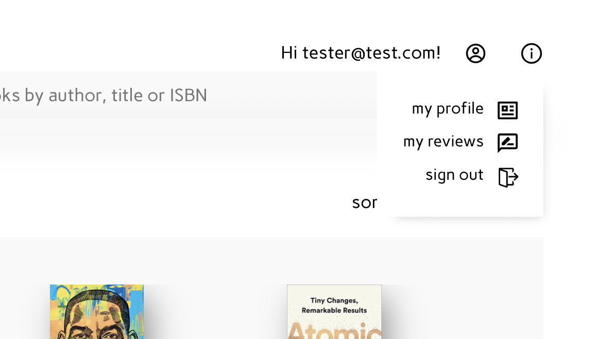
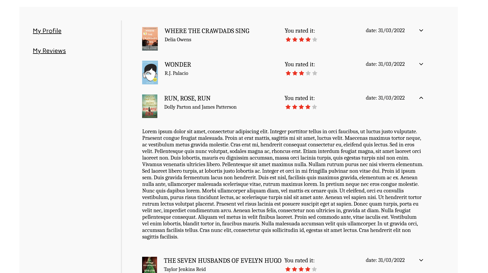

A React app for looking up books and book lists from the 'New York Times' Books API. 

Link to concept design (figma): https://www.figma.com/file/lTHK9k6FxxLiSRDcSYqFlV/BestBooks.store?node-id=0%3A1

Technologies used:

- Axios
- Redux Toolkit
- Redux Thunks
- React-router
- Firebase authentication
- Firebase database
- Lodash

The homepage features an overview of all books retrieved from the NYTimes API and provides the user to filter books on author, publisher, list rank and how long the book has been on it's current ranked list. From the homepage the user can easily navigate to the browse lists page where he/she can find an overview of all best seller lists maintained by NYTimes. Lists are updated weekly or monthly. 

When clicking on a specific list the user can view each individual book to retrieve more information on said book, and quickly navigate to other books in that list on the right hand side.

The dynamic search functionality adds an additional way of filtering.

User authentication is done via firebase. 

A user can inspect and change it's own profile aswell as see & edit reviews they have posted.

Users can leave reviews and view an overview of all their reviews in the profile tab.

All components are build from scratch with the exeption of the Loader indicator. Components are build in a way that is easy to understand and extensive use of external libraries is minimized. This no nonsense approach makes this application, in my opinion, highly maintainable.

Loader indicator from: https://mhnpd.github.io/react-loader-spinner/

